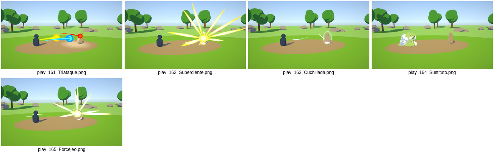

# Emerald Moves — 165 effects

All runtime assets live under `Assets/EmeraldMoves/`: Prefabs, Scripts/Runtime, Materials, Meshes, Textures, Shaders, Data, Models and Licenses.

## Import and play
1. Use Unity **6000.6.4f1 + URP 17.6.0**; install URP separately and configure your pipeline. Other versions are not verified. No project settings are included.
2. Import the whole package. Drag a prefab from `Prefabs` into a scene.
3. On **Emerald Move Vfx**, enable **Play On Start**; optionally enable **Loop**, then enter Play mode. Effects are intentionally invisible while stopped; there is no editor preview UI in this runtime package.

For scripted use: `instance.GetComponent<BotwVfx.EmeraldMoveVfx>().Play();` and `StopAndClear()` before pooling. The whole prefab's local ground anchors are attacker `(-3,0,0)` and target `(3,0,0)`. Substitute actor replacement is optional: `instance.GetComponent<BotwVfx.EmeraldActorReplacement>()?.Bind(attackerTransform);`.

**Time ownership:** impact cues create `VfxDirector`, which writes global `Time.timeScale`. If your game owns time/camera feedback, clear the effect's `slowMotion` and `shakes` cue lists before playback. Disabling slow motion alone does not stop the director's base time-scale assignment.

## Actual rendered previews
Near-impact screenshots, not complete animation sequences. Final artistic colour/size polish remains unfinished.

[001–020](Documentation/Previews/impact-001-020.jpg) · [021–040](Documentation/Previews/impact-021-040.jpg) · [041–060](Documentation/Previews/impact-041-060.jpg) · [061–080](Documentation/Previews/impact-061-080.jpg) · [081–100](Documentation/Previews/impact-081-100.jpg) · [101–120](Documentation/Previews/impact-101-120.jpg) · [121–140](Documentation/Previews/impact-121-140.jpg) · [141–160](Documentation/Previews/impact-141-160.jpg)

## Existing imports
Back up your project first. This package preserves the original asset GUIDs. Do not assume importing over old `BotwVFX` / `EmeraldMoveVFX` folders relocates assets automatically, and do not delete folders containing other work. For guaranteed one-root layout, import into a clean project or migrate the existing assets using Unity's asset move tools with GUIDs intact.

## Credits
Retain [upstream license](Licenses/Emerald-UPSTREAM-LICENSE.txt) and [provenance](Documentation/UpstreamREADME.md): their scope does not relicense Pokémon material.

This work is based on "Substitute" (https://sketchfab.com/3d-models/substitute-a21a74a4d5cd42479beb0dab4944ee95) by LunaEagle (https://sketchfab.com/LunaEagle) licensed under CC-BY-4.0 (http://creativecommons.org/licenses/by/4.0/). Converted to FBX, grounded/scaled and adapted to the toon shader; retain [model license](Licenses/Substitute-LICENSE.txt).
